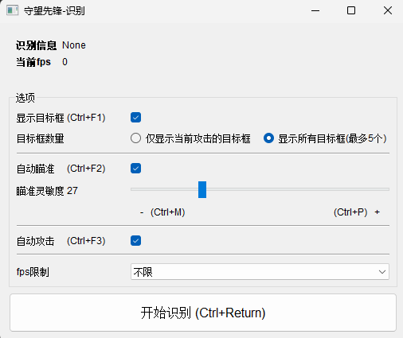
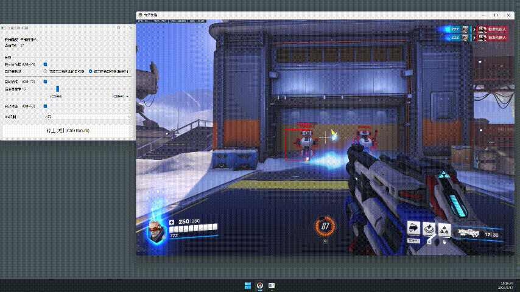

## 结构
```
+---.notebook  # 笔记
+---.train  # 训练文件
|       best-n.pt                 # 30次后的最佳模型
|       main.py                   # 训练任务
|       yolov8n.pt
|
+---bus  # 全局变量
|      option.py                  # gui界面的选项
|      signal.py                  # gui界面的全局信号
|      update_target_window.py    # 更新当前攻击目标的任务
|      window.py                  # 游戏窗口坐标和目标窗口坐标信息
|
+---control_mouse  # 鼠标控制
|      auto_aim.py                # 自动瞄准
|      auto_attack.py             # 自动攻击
|
+---detect  # 识别任务(核心)
|      detect_task.py             # 识别任务
|
+---gui  # gui界面
|   +---py_ui  # 界面类
|   |      float_window.py        # 悬浮窗用于标记目标
|   |      main.py                # 主窗口
|   +---ui  # designer 原始文件
|          main.ui
|
+---utils  # 工具函数
|      get_screen_shot.py         # 获取截屏
|
|   main.py                       # ✨项目入口
|   option.json                   # 界面选项配置(自动生成)
|   setting.py                    # 项目设置
```

## gui界面


## 运行 (理想情况: 单目标,人物静止)


# 不足
- 多个目标时自动瞄准会来回抖动


- 手动控制左右移动时自动瞄准跟不上
